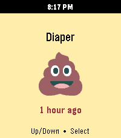
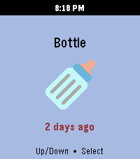
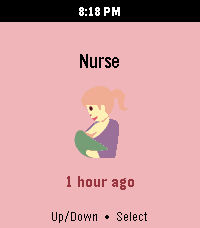
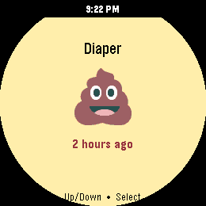
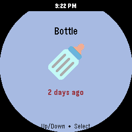

# Baby StoneFruit

A [Pebble](https://rebble.io/) watch app for one-tap logging of diaper changes and feedings to [Huckleberry](https://huckleberrycare.com/), routed through your own [Home Assistant](https://www.home-assistant.io/).

Built on the modern [Moddable Pebble JS SDK](https://developer.repebble.com/guides/alloy/) (Piu UI + Moddable XS). No custom backend — your Home Assistant *is* the backend.

## Features

- **Four one-tap actions:** Diaper, Bottle, Nurse, End Nursing
- **Color-coded screens** with emoji icons matching Huckleberry's mobile-app palette
- **Last-event time** below each icon (e.g. *5 min ago*) — turns red after 1 hour
- **Live nursing timer** that ticks while a session is active and *freezes* while paused
- **Pause / resume** the active nursing session directly from the watch (Select toggles)
- **Secrets stay encrypted in CloudPebble** — no tokens in source, no extra server to run

## Screenshots

Captured on a Pebble Time 2 (Emery, 200 × 228). The "X ago" line turns red once the last event is more than an hour old.

### Rectangular (Pebble Time 2, Emery)

| Diaper | Bottle | Nurse | End Nursing |
|---|---|---|---|
|  |  |  |  |

### Round (Pebble 2 Duo, Gabbro)

| Diaper | Bottle | Nurse | End Nursing |
|---|---|---|---|
|  |  |  |  |

## Requirements

- A **Pebble watch** running Rebble's modern firmware. Targets in `package.json`:
  - `emery` — Pebble Time 2
  - `gabbro` — Pebble 2 Duo
- A **Huckleberry** account with a child set up
- A **Home Assistant** instance reachable from your phone (local network or [Nabu Casa](https://www.nabucasa.com/))
- The **Huckleberry Home Assistant integration** by Woyken — [Woyken/huckleberry-homeassistant](https://github.com/Woyken/huckleberry-homeassistant) (install via [HACS](https://hacs.xyz/) or manually under `custom_components/`)
- A **[CloudPebble](https://cloudpebble.rebble.io/)** account to build & install (this project syncs from GitHub)

## Setup

### 1. Install and configure the Huckleberry HA integration

Follow the integration's [README](https://github.com/Woyken/huckleberry-homeassistant#readme). After signing in with your Huckleberry credentials, you should see one device per child and three sensors per device:

- `sensor.<child_name>_diaper` *(TIMESTAMP — last diaper change)*
- `sensor.<child_name>_bottle` *(TIMESTAMP — last bottle)*
- `sensor.<child_name>_nursing` *(ENUM: `active` / `paused` / `none`)*

Quick sanity check from a terminal once you have a long-lived access token:

```bash
HA_URL='https://your-ha.example.com'
HA_TOKEN='eyJhbG...'
DEVICE_ID='your_child_device_id'

# Should return HTTP 200 + JSON
curl -s -o /dev/null -w "%{http_code}\n" \
  -H "Authorization: Bearer $HA_TOKEN" "$HA_URL/api/"

# Should log a diaper change in the Huckleberry mobile app
curl -X POST "$HA_URL/api/services/huckleberry/log_diaper_both" \
  -H "Authorization: Bearer $HA_TOKEN" \
  -H "Content-Type: application/json" \
  -d "{\"device_id\":\"$DEVICE_ID\",\"pee_amount\":\"medium\",\"poo_amount\":\"medium\",\"color\":\"yellow\",\"consistency\":\"runny\"}"
```

### 2. Create a long-lived access token

In Home Assistant: **Profile → Security → Long-Lived Access Tokens → Create Token**. Save it somewhere safe — you'll paste it into CloudPebble's encrypted env vars.

### 3. Find your child's device ID

**Settings → Devices & Services → Huckleberry →** click your child → click the **device ID** value to copy. It'll look like `e754ec7bb8cdca212be0cd0897c83eaf`.

### 4. Configure the app — either way works

**The easy way (recommended for end users):** install the built `.pbw`, then open the **Pebble companion app on your phone → gear icon next to Baby StoneFruit**. The in-app settings page asks for your HA URL, access token, device ID, and (optionally) the child's name. Settings live only on your phone.

**The build-time way (for developers building from source):** open the project in CloudPebble, **Settings → PebbleKit JS Environment Variables**, and add:

| Variable name        | Value |
|----------------------|-------|
| `Home_Assistant_URL` | your HA base URL, no trailing slash, e.g. `https://home.example.com` |
| `HA_long_token`      | the long-lived access token from step 2 |
| `HA_kid_device_id`   | the device ID from step 3 |

CloudPebble stores these encrypted at rest, but they are inlined into `pkjs/index.js` as string literals **at build time** and embedded in the compiled `.pbw`. That's fine for private dev installs, but **clear these env vars in CloudPebble before doing any publish-build**, or the resulting `.pbw` will ship your credentials to anyone who downloads it from the Rebble app store. See [`docs/APP_STORE.md`](docs/APP_STORE.md#%EF%B8%8F-important-clear-your-cloudpebble-env-vars-before-building-the-publish-build) for details and a recovery checklist if you've already published with values set.

Any value set via the in-app settings page overrides the env var.

### 5. Build and install

In CloudPebble, **Compile** the project, then install on your watch (real device or emulator). The Diaper screen should appear within a second, with a *X ago* timestamp below the icon if your child has any recent diaper events in Huckleberry.

## Usage

Single screen with four physical buttons:

| Button | Function |
|---|---|
| **Up** | Previous action |
| **Down** | Next action |
| **Select** | Log the current action *(or pause/resume during an active nursing session)* |
| **Back** | Exit the app |

### Actions

| Action | Color | Icon | Maps to |
|---|---|---|---|
| Diaper | 🟡 yellow | 💩 | `huckleberry.log_diaper_both` (medium pee + poo, yellow, runny) |
| Bottle | 🟣 purple | 🍼 | `huckleberry.log_bottle` (120 ml formula) |
| Nurse | 🩷 pink | 🤱 | `huckleberry.start_nursing` |
| End Nursing | 🟥 red | 🛑 | `huckleberry.complete_nursing` |

### Active-nursing flow

1. Cycle to **Nurse** and press **Select** — starts a session in Huckleberry.
2. The screen swaps the "X ago" line for a live `mm:ss` timer; the hint becomes *Select to pause*.
3. Press **Select** to call `huckleberry.pause_nursing`. The timer freezes at the current value; hint becomes *Select to resume*.
4. Press **Select** to resume; the timer continues from where it paused.
5. When you're done, cycle to **End Nursing** and press **Select** — calls `huckleberry.complete_nursing` and logs the session.

The on-watch timer mirrors HA's authoritative "current left + right duration" so it stays in sync with the Huckleberry mobile app even after pause/resume.

## How it works

```
Pebble watch (src/embeddedjs/main.js — Moddable XS / Piu)
    │  AppMessage  { ACTION: … }
    ▼
Phone (src/pkjs/index.js)  ←  CloudPebble env vars inlined at build time
    │  HTTPS calls to:
    │    POST /api/services/huckleberry/<service>   ← log actions / pause / resume
    │    POST /api/template                          ← fetch last-event timestamps
    ▼
Home Assistant + Woyken/huckleberry-homeassistant
    │  huckleberry-api (Python) over Firebase
    ▼
Huckleberry / Firestore
```

- **Watch ↔ phone** uses Pebble AppMessage (`pebble/message`) — small payloads, declared in `package.json`'s `messageKeys`.
- **Phone ↔ HA** uses regular `XMLHttpRequest` (the phone has real browser APIs; the watch does not).
- **Last-time discovery** uses HA's `device_entities()` template function to find the configured child's `*_diaper`, `*_bottle`, `*_nursing` sensors — no extra env vars needed, and stale `*_last_*` entities from older integration versions are skipped via a negative-lookbehind regex.

## Why does this need Home Assistant?

Huckleberry's backend is **Google Cloud Firestore**, which is accessed over **gRPC** (HTTP/2 with protobuf framing). There's no public REST endpoint to call. Every working library out there — including the Python [`huckleberry-api`](https://pypi.org/project/huckleberry-api/) this project ultimately relies on — goes through Firebase's gRPC SDK.

The Pebble JS environment can't speak gRPC, on either side of the bridge:

- The **watch** runs Moddable XS — a small embedded JS runtime. App size budget is tiny, the network stack is bridged through the phone, and the module system is custom (no `npm`). gRPC-web and the Firebase JS SDK are both far too large and don't fit anyway.
- The **phone companion** (PebbleKit JS / `pkjs`) is a sandboxed JS context with browser-ish APIs (`XMLHttpRequest`, `fetch`). It can do plain HTTPS to anything, but it can't load the Firebase SDK either (size + bundling) and there's no native gRPC stack.

So something else has to translate "HTTPS request the phone *can* make" into "gRPC call to Firestore". Pretty much anything that runs Python works for this — an earlier prototype of this app used a tiny custom Flask proxy that wrapped `huckleberry-api` directly. Home Assistant happens to be a particularly good fit because:

1. It runs Python, so [`huckleberry-api`](https://pypi.org/project/huckleberry-api/) and the Firebase SDK Just Work.
2. It already exposes a clean **HTTPS REST API** that the Pebble companion can call.
3. There's already a maintained integration — [`Woyken/huckleberry-homeassistant`](https://github.com/Woyken/huckleberry-homeassistant) — that wraps `huckleberry-api`, polls Firestore in the background, exposes `sensor.*_diaper` / `*_bottle` / `*_nursing` entities, and registers services like `huckleberry.log_diaper_both` and `huckleberry.pause_nursing`. The watch just calls those services over HTTPS.

The chain *watch → phone → Home Assistant → Huckleberry* looks indirect on the diagram, but every hop does something the next one can't.

### Alternatives if you don't already run Home Assistant

Any small Python service exposing HTTPS works as a drop-in replacement for HA in the chain. The earliest prototype here was a Flask app that hosted `huckleberry-api` directly and exposed routes like `POST /diaper`. If that's appealing — you don't want a full HA install just for this — the source history of [PR #11 and earlier](https://github.com/michaellunzer/babystonefruit/pulls?q=is%3Apr+is%3Aclosed) has the Flask prototype. Updating `pkjs/index.js` to point at your proxy's URLs instead of HA service paths is a small change.

> **If I have something wrong here**, please open an issue. I'd love to know if there's a way to talk to Huckleberry directly from Pebble JS — that would simplify everything.

## Repository layout

```
.
├── package.json                # Pebble project + CloudPebble env-var refs + resources
├── config/
│   └── config.html             # Pebble in-app settings page (served via GitHub Pages)
├── resources/img/              # Twemoji PNGs (poop, bottle, nursing, stop)
└── src/
    ├── embeddedjs/             # Runs on the watch (Moddable XS)
    │   ├── main.js             # UI, button input, AppMessage to pkjs, time ticker
    │   └── manifest.json
    ├── pkjs/
    │   └── index.js            # Runs on the phone — HA fetch + state fetch + settings
    └── c/
        └── mdbl.c              # Moddable boilerplate (untouched)
```

The settings page is hosted via GitHub Pages at <https://babystonefruit.michaellunzer.com/config/config.html>. When the user opens the gear icon in the Pebble companion app, `showConfiguration` in `pkjs/index.js` opens that URL with the current settings encoded in the query string. The page redirects back with the new settings via the `pebblejs://close#…` scheme; pkjs persists them in `localStorage`.

## Limitations & known gaps

- **Bottle has no "session" concept.** Huckleberry models a bottle feeding as a one-shot event with `amount_ml`. The watch logs 120 ml of formula instantly when you press Select. There's no live bottle timer because there's no server-side equivalent of `pause_nursing`.
- **Single-child only for now.** The integration supports multiple children; the watch app currently uses one configured `HA_kid_device_id`. An in-app child picker is a reasonable future addition.
- **Pebble app size is small.** All four emojis are bundled as 72×72 PNGs — total app size is well under the watch's storage budget, but adding much more (sound, additional icons) requires care.
- **Polling cadence.** The watch refreshes state on startup and after each successful log. Externally-triggered changes (e.g. logging from the Huckleberry mobile app) won't show up until the next watch action.

## Changelog

See [`CHANGELOG.md`](./CHANGELOG.md). Current version: **1.0.1**.

## Credits

- **[Huckleberry](https://huckleberrycare.com/)** — the baby tracking app this hooks into.
- **[Woyken/huckleberry-homeassistant](https://github.com/Woyken/huckleberry-homeassistant)** — the unofficial HA integration that bridges Huckleberry's Firestore to HA entities and services. None of this would exist without it.
- **[Moddable](https://www.moddable.com/)** — the JS runtime used by the modern Pebble SDK.
- **[Rebble](https://rebble.io/)** — keeping Pebble alive years after the original company shut down.
- **[CloudPebble](https://cloudpebble.rebble.io/)** — the web IDE used to build and install this.
- **[Twemoji](https://github.com/jdecked/twemoji)** (MIT) — the emoji bitmaps in `resources/img/`.
- **Home Assistant** — the glue layer that makes calling Huckleberry from a watch a sane thing to do at all.

### Sound effects (planned)

The following UI sounds by **MATUSTRM** ([freesound.org](https://freesound.org/people/MATUSTRM/)) are intended for future audio feedback — not yet integrated due to Pebble's tight memory constraints. All released under [Creative Commons 0](https://creativecommons.org/publicdomain/zero/1.0/).

- *UI_Confirm* — <https://freesound.org/s/836200/>
- *UI_Hover* — <https://freesound.org/s/836201/>
- *Pause* — <https://freesound.org/s/836021/>
- *Resume* — <https://freesound.org/s/836022/>
- *Completed* — <https://freesound.org/s/835880/>

## Built with Claude

Heads up — this was vibe coded. I built the whole thing in a long back-and-forth using [Claude Code](https://claude.com/claude-code). I'd describe what I wanted, run whatever it spat out on the watch, tell it what broke, and we'd go again. Pretty fun, and we got surprisingly far. Every change ended up tested on a real Pebble against a real Huckleberry account before it was published to the Pebble App Store.
